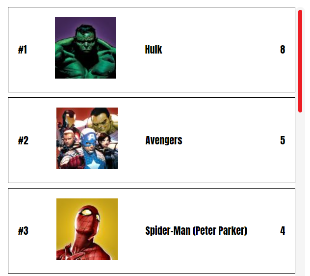

# Marvel Ranked

[Live Site](https://marvel-ranked.vercel.app/)

[Demo Video](https://youtu.be/cQHCrjL2L8M)

## About the project ❓

---

This project was build for Hacktoon 2 from MLH. This was my second time taking part in a hackathon and it has been a wild weekend since I was also working and moving house. For that reason I didn’t make as much progress as I would have liked.

The topic for the hackathon was all about comics and cartoons.

Marvel has also been one of my favourite comic publishers so once I found that they had an API I had to make something with it.

## The problem 🤔

Many arguments have been had over juice boxes in the school yard and beers in pubs over which Marvel comics character is the best.

## The solution 💡

It’s time to put and end to the arguments and give the people what they want, a way to rank their favourite characters and decide on a winner once and for all.

Marvel Ranked shows two Marvel comic characters at random and the user can vote on which one they think is best. The most cited characters are shown on the leaderboard.

## How the game works 🎯

Two random offsets are generated and then the cache is checked. If the character exists in the cache, no API call is made. This is because the Marvel API is rate limited. Characters are stored in the cache for one week.

Once the user votes on a character, if a document exists with the same character ID in the “votes” database, then the number of votes is incremented by 1. If the character hasn’t been voted on before, a new document is created. This document contains the number of votes, the character name and the URL for the character thumbnail.

### Built with ⚒️

**Front End**

-   ReactJs
-   CSS
-   Typescript
-   Hosted on Netlify

**API**

-   Marvel Developers API

**Back End (as a service)**

-   Firebase

### What I learned from this project

This project was a great experience. I've only been using TypeScript for a few weeks and I'm starting to feel more comfortable and I'm relying less on "any".

It was also a great learning experience in relation to time management. There's so much more I would have liked to do but since I had a lot on this weekend, I had to just push out the bare essentials. For once I didn't get caught up in tiny details and I kept progressing.

Finally, I was able to learn more about Firebase. I used Firestore Cloud Functions for the first time to removed expired documents from the cache.

### Next steps

-   Improve ranking of characters
    -   Store times character appears
    -   display a percentage on leaderboard (appeared/votes)
-   Add other rankings
    -   Comics
    -   Series
-   Search
    -   Allow users to search for their favourite character to see the character’s information
-   Testing
    -   Unit tests

### Screenshots

Character card

Character card (hover)

Leaderboard

